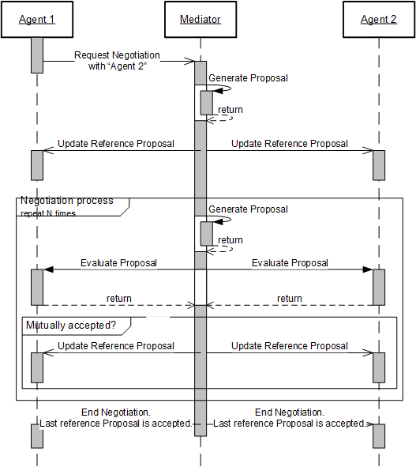

# Verhandlungsprotokoll

## Verhandlungsbeginn
Der Agent, der die Primärbedarfe erfüllen soll, beantragt die erste Verhandlung mit dem
zuliefernden Agenten beim Mediator. Der Mediator generiert daraufhin eine erste Referenzlösung.
Diese, sowie eine weiterer Vorschlag werden an beide Agenten geschickt.

## Iterative Verhandlung
Wenn ein Agent einen Vorschlag vom Mediator empfängt, dann bildet er daraus einen Plan, bewertet
diesen und vergleicht die Güte des Plans mit der Güte der Referenzlösung. Die Agenten schicken
ihre Präferenz an den Mediator.

Falls beide die Lösung akzeptieren, so ist dies die neue Referenzlösung. Der Mediator generiert
danach eine neue Lösung und schlägt diese den Agenten vor.

## Ende der Verhandlung
Nach einer bestimmten Anzahl an Iterationen beendet der Mediator die Verhandlung. Der letzte
gemeinsam akzeptierte Lösungsvorschlag ist das Ergebnis der Verhandlung.

## Diagramm

## Zu den Verhandlungen nach Finke
- beide Agenten müssen T ausrechnen, indem sie zum Ausgangsprodukt 100 Lösungen berechnen und die durchschnittliche Abweichung berechnen
- dieses T bleibt auf dem Agenten und wird während der ganzen Verhandlungen genutzt (e^((alt - neu)/T))
- Damit soll vermieden werden, dass ein Agent nur 10% an Verschlechterung akzeptiert, der andere jedoch 50%
- Vorteil: Verhandlung hat nur ja/nein
- Nachteil: Code Duplizierung auf Mediator / Agent zur Berechnung der Nachbarn

## Zu den Verhandlungen nach Homberger
- Jeder Agent bekommt einen Satz an Vorschlaegen und muss die besten auswaehlen
- Der Mediator entscheidet anhand der Uebereinstimmungen, welcher Satz als naechstes benutzt wird
- es könnte z.B. nach Praeferenz sortiert werden
- Vorteil: Keine init Phase notwendig, keine Code Duplizierung
- Nachteil: Mehr Daten zu versenden, mögliche Beeinflussung bei lernenden Agenten